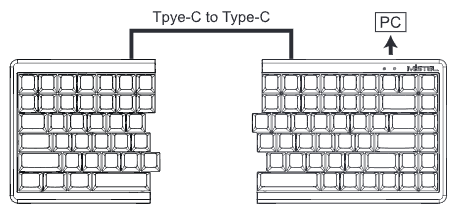
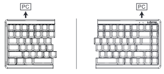
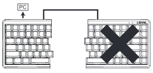
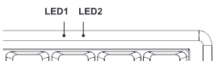
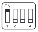
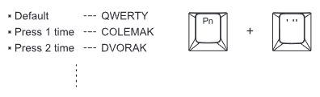
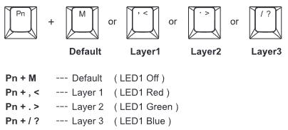
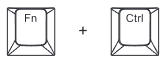
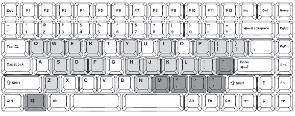

# MD770_User_Manual_KR

# 이 문서는 Mistel Keyboard MD770의 사용자 매뉴얼 PDF에서 필요한 자료를 가져와 번역한 것입니다. 이 과정에서 일부 내용이 원본 PDF와 다를 수 있으며, 번역 오류나 부정확한 정보가 포함될 수 있습니다. 따라서, 중요한 정보를 확인할 때는 반드시 원본 문서를 참조하시기 바랍니다. 이 문서는 참조용으로만 사용되며, Mistel의 공식 문서가 아닙니다.

## MD770 구성요소:

- MD770 키보드 (두개의 반쪽)
- USB C to C 코일케이블 (1pcs)
- USB A to C 케이블 (1pcs)
- Mistel 키캡 풀러
- 고무스탠드 / 나사 (4pcs)
- 유저 메뉴얼 (1pcs)

## MD770 스펙:

- 모델: Barocco MD770
- 키보드 레이아웃: ANSI, JIS
- 키캡: PBT 이중사출
- 매크로 기능: 포함
- 폴링 레이트: 1000Hz
- Matrix: NKRO (N-Key RollOver) - 전 키 동시 입력
- 미디어 키: 포함
- 온보드 메모리: 포함
- 운영체제: Window OS / Mac OS
- 크기: L 334.5mm X W 140mm x H 34.5mm
- 무게: 800g

## 키보드 설치:

■ 사용하기 전에 키보드와 내용물을 확인하여 모든 기능이 제대로 작동하는지 확인합니다.
- 모든 스위치가 OFF 되어있는지
- 모든 키가 부드럽고 정상적 인지
- 모든 주변기기가 박스안에 포함되어있는지

 

**우측 키보드가 메인입니다.** 
첫번째로 USB C to C 코일케이블을 양쪽 키보드의 커넥터에 연결합니다. 
그리고 USB A to C 케이블을 우측 키보드와 컴퓨터를 연결합니다.

키보드를 별도로 사용하려면 USB A to C 케이블을 양쪽 커넥터에 삽입하고 양쪽 커넥터 사이에 있는 USB C-C 코일 케이블을 제거합니다.

 
\*두 키보드가 코일케이블 연결된 경우 USB A to C  케이블을 좌측 키보드에 연결하면 우측 키보드가 제대로 작동하지 않습니다.

## LED 인디케이터: (상태표시등)

■ LED 1: 키보드 레이어 / 키보드 설정 표시등. 
설정할 키보드의 레이어를 선택하고 이를 통해 서로 다른 기능의 설정할 수 있습니다.

- LED1 Off  --- 기본 레이어
- LED1 Red  --- 레이어1
- LED1 Green    --- 레이어2
- LED1 Blue --- 레이어3
- LED1 White    --- 키보드 설정

■ LED 2: Capslock 표시등 (Red)

## DIP 스위치:

※ 필자는 [Dip Switch 4] 사용중

■ 우측 키보드 뒷면의 스위치
- Dip Switch 1 ON: Mac 레이아웃; OFF : Windows 레이아웃
- Dip Switch 2 ON: [Capslock] 와 [좌측_Ctrl] 키의 포지션 교체
- Dip Switch 3 ON: [좌측_Win] 와 [좌측_Alt] 키의 포지션 교체
- Dip Switch 4 ON: [Capslock] 와 [Fn] 키의 포지션 교체

## 키보드 레이아웃 스위치:

■ 키보드 배열 변경.

Pn + ' 키를 통해 사이클형식으로 다른 키보드 배열을 선택 할 수있습니다.

\* QWERTY -> COLEMARK -> DVORAK ...

## 매크로:

■ 매크로 설정 설명:
- 매크로 설정은 기본 레이어에는 사용이 금지 되어있습니다.
- 매크로 설정에서 [Pn] / [Fn] 는 허용되지 않습니다.

1. 레이어를 선택합니다. (1, 2, 3)

2. [Fn] + [우측_Ctrl] 을 눌러 매크로 모드에 진입합니다. (레이어에 맞는 LED 점멸 확인)

3. 키를 적용 진행시 LED1 흰색 점멸이 깜빡일 것입니다.
    1. 새로운 매크로의 키 위치를 선택합니다.
    2. 변경할 버튼을 누릅니다. (예를 들어 'L'키 먼저 누르고 'P'키 누를시 'L'키의 위치가 'P' 키로 변경됩니다.)
4. [Pn] 키를 한번 눌러 새 설정을 저장합니다. (LED1 점멸이 흰색으로 다시 돌아옴)
5. [Fn] + [우측_Ctrl] 를 다시 눌러 매크로 모드를 종료 합니다. (LED1 꺼짐)
6. 원래 키를 다른 키로 변경하려면 1~5단계를 반복합니다.

## 리맵핑:

**리맵핑은 큰 필요성을 못느껴서 과정에서 제외했습니다.**

## 초기화:

- 현재 단일 레이어 재설정(초기화): 레이어를 선택 후 [Fn] + [R]을 누르고 LED1 이 5회 깜빡이는 동안 유지합니다.
- 전체 키보드 재설정: [Alt] 키 2개를 누르고 LED1 이 5회 깜빡이는 동안 유지합니다.
    1. 경고: 설정된 모든 레이어, 매크로 및 리맵핑이 초기화됩니다.

## [Fn] / [Pn] 키맵

| [Pn]                  | [Fn]                      |
|:---------------------:|:-------------------------:|
| ['] : 키보드 배열 변경 | [Q] : 이전 트랙           |
| [좌측_Win] : Win Lock  | [W] : 재생 / 일시정지     |
|                       | [E] : 다음 트랙           |
| [M] : 기본 레이어      | [S] : 볼륨 증가           |
| [<] : 레이어 1         | [D] : 볼륨 감소           |
| [>] : 레이어 2         | [F] : 음소거              |
| [/] : 레이어 3         | [P] : PrintScreen         |
|                       | [ : Scroll Lock          |
|                       | ] : Pause                |
|                       | [;] : Insert              |
|                       | [H] : Home                |
|                       | [N] : End                 |
|                       | [I] : 위방향키            |
|                       | [J] : 왼방향키            |
|                       | [K] : 아래방향키          |
|                       | [L] : 오른방향키          |
|                       | [Z] : 도구 / 오른쪽 마우스|
|                       | [Y] : 계산기              |
|                       | [R] : 레이어 초기화       |

## Mac OS 기능:

- Mac OS 에서는 키보드 펌웨어 업그레이드를 할 수 없습니다.
- DIP 스위치가 Mac 모드인지 확인 (Dip Switch 1 ON)

| Key  | Function       |
|:----:|:--------------:|
| [F1] | 화면 밝기 감소  |
| [F2] | 화면 밝기 증가  |
| [F3] | 미션 컨트롤     |
| [F4] |                |
| [F5] | 키보드 밝기 감소 |
| [F6] | 키보드 밝기 증가 |
| [F7] | 이전 트랙      |
| [F8] | 재생 / 일시정지 |
| [F9] | 다음 트랙      |
| [F10] | 음소거        |
| [F11] | 볼륨 감소     |
| [F12] | 볼륨 증가     |

